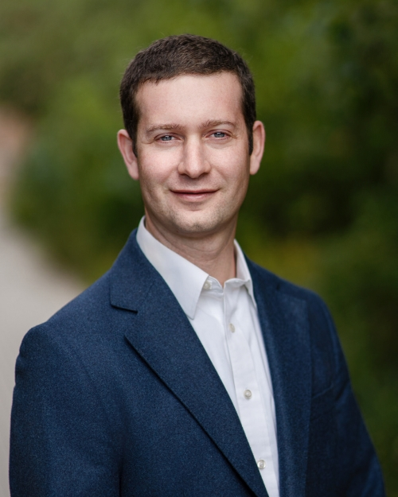

<!--
<table>
  <tr>
    <td></td>
    <td>
      
<b>Eli P. Fenichel</b>

      
Knobloch Family Professor of Natural REe source Economics

      
Yale University

      
Yale School of Environment

      <a href="https://scholar.google.com/citations?user=PTFuF2cAAAAJ&hl=en">Visit Google Scholar for publications</a>
    </td>
  </tr>
</table>

<a href="https://environment.yale.edu/directory/faculty/eli-fenichel"> Prof Fenichel's Yale School of the Environment website</a>

<a href="https://scholar.google.com/citations?user=PTFuF2cAAAAJ&hl=en"> Prof Fenichel's Publications on Google Scholar</a>  

<a href="fenichel_CV.pdf"> CV</a>

-->

|  |  |
|-------|-------------| 
|  | <a href="https://scholar.google.com/citations?user=PTFuF2cAAAAJ&hl=en"> Prof Fenichel's Publications on Google Scholar</a>    <a href="https://environment.yale.edu/directory/faculty/eli-fenichel"> Prof Fenichel's Yale School of the Environment website</a>   <a href="fenichel_CV.pdf"> CV</a>

# Research
My research focuses on how people make forward-looking decisions over systems that they don't completely control, primarily ecosystem and epidemiological systems. Two current areas were I am focused are how natural assets can and should be valued for the purposes of national balance sheets and where does nature capitalize into financial systems.

# Opportunities
## Post docs
I anticipate starting to search for post docs for the AY starting fall 2025 soon. I will look for people with strong backgrounds in economics and understanding of ecological systems.
## PhD students
I am not currently anticipating bring on a new PhD student in fall 2025, but will make a final decision about this in October or November 2024.
## Master's Students
Please start with the Yale YSE admissions office. 
